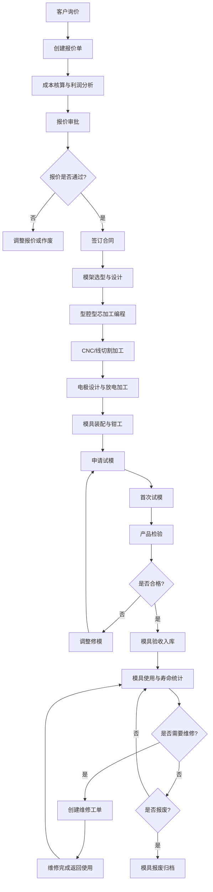

## 1. 产品概述

本系统是面向模具制造企业的注塑模业务全流程管理客户端软件，覆盖模具从报价、设计、加工、试模到维修保养的完整生命周期管理。系统通过7大核心模块实现对模具制造各环节的数字化管控，帮助企业提升生产效率、降低成本、规范流程、追溯质量。

## 2. 核心功能

### 2.1 用户角色

| 角色 | 注册方式 | 核心权限 |
|------|----------|----------|
| 系统管理员 | 系统初始化创建 | 全部功能权限、用户管理、系统配置 |
| 销售报价员 | 管理员创建 | 模具报价管理、客户信息管理 |
| 设计工程师 | 管理员创建 | 模架选型、图纸管理、BOM维护 |
| 生产主管 | 管理员创建 | 零件加工、电极、装配任务分派与进度跟踪 |
| 加工操作员 | 管理员创建 | 加工任务执行、工序记录、设备状态上报 |
| 质检工程师 | 管理员创建 | 试模记录、产品检验、质量报告 |
| 仓库管理员 | 管理员创建 | 模具入库、易损件库存、台账管理 |

### 2.2 功能模块

1. **模具报价模块**: 报价单创建、成本核算模板、利润计算、报价审批、报价历史
2. **模架选型模块**: 标准模架库、智能选型推荐、模架参数配置、模架图纸预览
3. **零件加工模块**: 型腔型芯加工工单、CNC编程记录、加工工序跟踪、慢走丝线切割任务
4. **电极放电模块**: 电极设计BOM、电极材料管理、EDM加工记录、电极损耗统计
5. **装配钳工模块**: 装配任务清单、钳工工时记录、装配检验项、模具预验收
6. **试模验收模块**: 试模申请、首次试模记录、注塑参数记录、产品检验报告、模具寿命统计
7. **维修保养模块**: 维修工单创建、故障诊断、易损件更换、保养计划、模具入库台账

### 2.3 页面详情

| 页面名称 | 模块名称 | 功能描述 |
|----------|----------|----------|
| 工作台首页 | 仪表盘 | 数据概览卡片、待办任务、在制模具进度、统计图表、快捷入口 |
| 报价单列表 | 模具报价 | 报价单搜索筛选、状态标签、新建/编辑/删除操作、导出Excel |
| 报价单详情 | 模具报价 | 客户信息、模具规格、材料成本、加工工时、利润核算、审批流程 |
| 模架库 | 模架选型 | 模架分类筛选、规格参数表、尺寸对比、3D预览入口、快速选型 |
| 模架配置 | 模架选型 | 模架参数配置、附件选择、价格计算、生成BOM清单 |
| 加工任务看板 | 零件加工 | 工序卡片、任务状态流转、进度条、操作员分配、设备绑定 |
| 型腔型芯加工 | 零件加工 | 工艺路线、程序单号、刀具清单、加工参数、质检记录 |
| 线切割任务 | 零件加工 | 慢走丝工单、切割路径、丝材规格、切割工时、精度检测 |
| 电极管理 | 电极放电 | 电极清单、材料规格、EDM参数、放电工时、电极寿命统计 |
| 装配任务 | 装配钳工 | 装配BOM、步骤清单、工时填报、检验项确认、问题记录 |
| 试模申请单 | 试模验收 | 试模条件检查、设备预约、材料准备、试模次数统计 |
| 试模记录 | 试模验收 | 注塑工艺参数、试样编号、缺陷记录、调整措施、照片上传 |
| 产品检验报告 | 试模验收 | 尺寸检测、外观检验、性能测试、合格率统计、判定结果 |
| 寿命统计看板 | 试模验收 | 模具档案、累计模次、维护记录、寿命预测曲线、预警提醒 |
| 维修工单 | 维修保养 | 故障描述、原因分析、维修方案、维修工时、更换配件 |
| 易损件管理 | 维修保养 | 零件档案、库存预警、出入库记录、更换历史、供应商信息 |
| 模具台账 | 维修保养 | 模具档案卡、入库记录、借出归还、状态流转、盘点管理 |
| 系统设置 | 系统管理 | 用户管理、角色权限、基础数据配置、系统日志 |

## 3. 核心流程

### 3.1 模具全生命周期主流程

### 3.2 试模修模迭代流程

## 4. 用户界面设计

### 4.1 设计风格

- **主色调**: 工业蓝 (#1E3A5F)，体现制造业专业稳重感
- **辅助色**: 橙色 (#E87722) 用于强调操作按钮和进度状态，绿色 (#2E7D32) 表示完成/合格，红色 (#C62828) 表示异常/警告
- **中性色**: 深灰至浅灰阶，构成信息层次感
- **按钮风格**: 微圆角(6px)、悬浮阴影、点击凹陷、状态色渐变
- **字体**: 标题使用思源黑体Bold，正文使用思源黑体Regular，数据表格使用等宽数字字体
- **布局风格**: 左侧导航栏 + 顶部工具栏 + 主内容卡片式布局，列表页使用表格+筛选栏，详情页使用分组标签页
- **图标风格**: Lucide线性图标，与工业蓝主题统一，操作按钮图标+文字组合

### 4.2 页面设计概述

| 页面名称 | 模块名称 | UI元素 |
|----------|----------|--------|
| 工作台首页 | 仪表盘 | 统计数据卡片(渐变背景+图标)、任务进度环形图、模具状态分布饼图、在制列表时间线、快捷入口瓷砖卡片 |
| 列表页(通用) | 各模块列表 | 顶部搜索筛选栏、批量操作工具栏、数据表格(斑马纹、固定列、状态标签、操作列)、分页器、导出按钮 |
| 详情页(通用) | 各模块详情 | 顶部面包屑导航+状态流程条、基础信息卡片、分组标签页(Tabs)、子数据表格、附件上传区、底部操作栏 |
| 新建/编辑页(通用) | 各模块表单 | 分组表单分区、必填项红星标记、下拉选择/日期选择/数字输入、实时价格计算、保存草稿/提交审批按钮 |
| 任务看板 | 加工/装配 | 列状看板(待开始/进行中/已完成)、可拖拽卡片、进度条、负责人头像、超时红色预警 |

### 4.3 响应式设计

- 采用桌面优先(Desktop-first)设计，最小支持分辨率1366x768
- 主内容区最小宽度1024px，侧边栏可折叠收缩为图标栏
- 表格支持横向滚动，关键列(编号、名称、状态)固定左侧
- 弹窗表单采用800-1000px固定宽度居中显示，超出内容区可滚动

### 4.4 动效与交互

- 页面切换：淡入(150ms ease-out)
- 卡片悬浮：阴影加深+微位移(2px translateY, 200ms)
- 按钮点击：Y轴1px按压效果
- 进度更新：数字滚动动画(countUp)
- 状态流转：横向流程节点高亮渐变
- 数据加载：骨架屏脉冲占位
