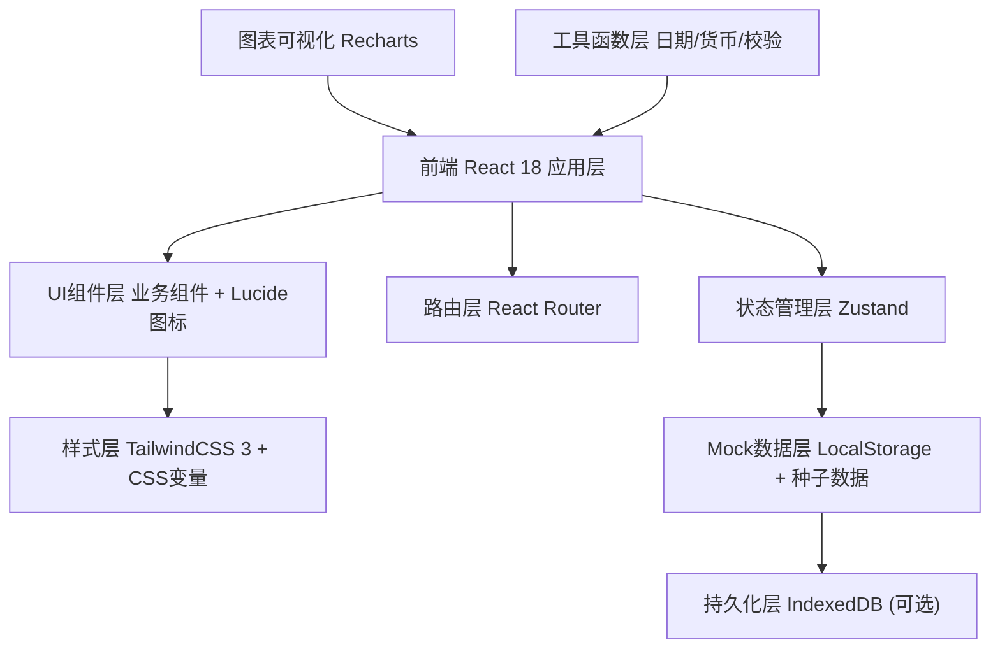
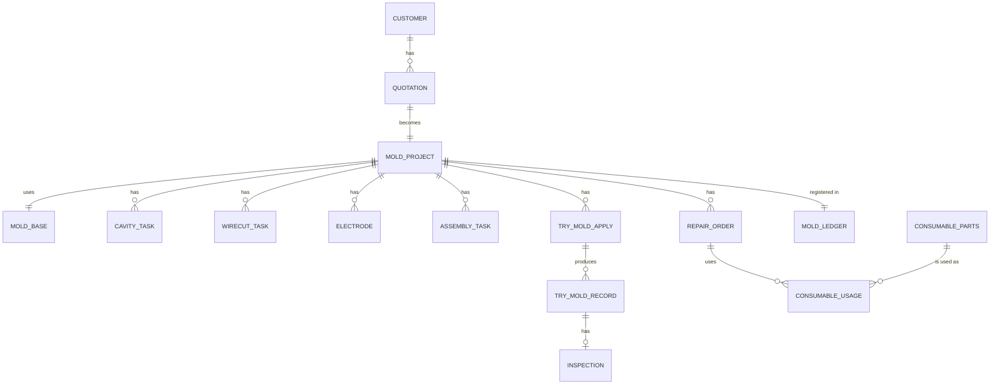

## 1. 架构设计



## 2. 技术描述

- **前端框架**: React@18.2 + TypeScript@5
- **构建工具**: Vite@5 (使用 vite-init 初始化)
- **路由管理**: react-router-dom@6
- **状态管理**: zustand@4 (含 persist 中间件持久化到 localStorage)
- **样式方案**: TailwindCSS@3.4 + CSS Variables + 自定义主题色
- **UI组件库**: 基于Tailwind手写组件(避免引入重型UI库) + lucide-react图标库
- **图表组件**: recharts@2 (柱状图、折线图、饼图、环形进度图)
- **表单方案**: 受控表单 + 原生校验 + 自定义hooks
- **数据持久化**: Zustand persist + localStorage (前端本地Mock模式)
- **后端**: 不搭建真实后端服务，采用 Mock 数据 + 前端本地存储模式
- **日期处理**: dayjs (轻量替代moment)
- **导出功能**: 使用前端 CSV/JSON 导出 (xlsx库可选)
- **模板类型**: react-ts (纯前端，不包含Express后端)

## 3. 路由定义

| 路由路径 | 页面组件 | 功能说明 |
|----------|----------|----------|
| `/` | Dashboard | 工作台仪表盘首页 |
| `/quotation` | QuotationList | 报价单列表页 |
| `/quotation/new` | QuotationForm | 新建报价单 |
| `/quotation/:id` | QuotationDetail | 报价单详情页 |
| `/quotation/:id/edit` | QuotationForm | 编辑报价单 |
| `/moldbase` | MoldBaseList | 标准模架库列表 |
| `/moldbase/:code` | MoldBaseDetail | 模架详情与选型配置 |
| `/machining` | MachiningBoard | 零件加工看板 |
| `/machining/cavity` | CavityList | 型腔型芯加工工单 |
| `/machining/cavity/:id` | CavityDetail | 加工工单详情 |
| `/machining/wirecut` | WireCutList | 慢走丝线切割任务 |
| `/electrode` | ElectrodeList | 电极管理列表 |
| `/electrode/:id` | ElectrodeDetail | 电极EDM加工详情 |
| `/assembly` | AssemblyList | 装配任务列表 |
| `/assembly/:id` | AssemblyDetail | 装配钳工详情 |
| `/trymold` | TryMoldList | 试模申请列表 |
| `/trymold/record/:id` | TryMoldRecord | 试模记录表单 |
| `/trymold/inspection/:id` | InspectionReport | 产品检验报告 |
| `/trymold/lifetime` | LifetimeDashboard | 模具寿命统计看板 |
| `/maintenance` | RepairList | 维修工单列表 |
| `/maintenance/:id` | RepairDetail | 维修工单详情 |
| `/maintenance/parts` | ConsumableParts | 易损件管理 |
| `/maintenance/ledger` | MoldLedger | 模具入库台账 |
| `/settings` | Settings | 系统设置页 |
| `*` | NotFound | 404页面 |

## 4. 数据模型 (Zustand Store)

### 4.1 ER关系图



### 4.2 核心实体类型定义

```typescript
// 客户
interface Customer {
  id: string;
  name: string;
  contact: string;
  phone: string;
  address: string;
  createdAt: string;
}

// 报价单
interface Quotation {
  id: string;
  quotationNo: string;
  customerId: string;
  customerName: string;
  moldName: string;
  moldType: string;
  cavityQty: number;
  productMaterial: string;
  estimatedTonnage: number;
  estimatedCycles: number;
  materialCost: number;
  machiningCost: number;
  electrodeCost: number;
  assemblyCost: number;
  tryMoldCost: number;
  otherCost: number;
  totalCost: number;
  profitMargin: number;
  profitAmount: number;
  quotationPrice: number;
  deliveryDays: number;
  status: 'draft' | 'pending' | 'approved' | 'rejected' | 'expired';
  createdAt: string;
  approvedAt?: string;
  remark?: string;
}

// 模具项目 (报价通过后生成)
interface MoldProject {
  id: string;
  projectNo: string;
  quotationId: string;
  moldName: string;
  customerId: string;
  customerName: string;
  moldBaseCode: string;
  status: 'design' | 'machining' | 'assembly' | 'trymold' | 'completed' | 'maintenance' | 'scrapped';
  totalCycles: number;
  currentCycles: number;
  createdAt: string;
  plannedDeliveryDate: string;
  actualDeliveryDate?: string;
}

// 标准模架
interface MoldBase {
  id: string;
  code: string;
  type: string;
  series: string;
  plateThickness: {
    a: number; b: number; c: number; d: number; e: number;
  };
  length: number;
  width: number;
  guidePillar: string;
  ejectorType: string;
  material: string;
  weight: number;
  price: number;
  imageUrl: string;
}

// 型腔型芯加工任务
interface CavityTask {
  id: string;
  projectId: string;
  projectNo: string;
  partName: string;
  partType: 'cavity' | 'core' | 'slide' | 'lifter';
  material: string;
  hardness: string;
  processRoute: string[];
  currentProcess: number;
  programNo: string;
  cncMachine: string;
  operator: string;
  planHours: number;
  actualHours: number;
  status: 'pending' | 'programming' | 'machining' | 'inspection' | 'completed';
  startDate: string;
  finishDate?: string;
}

// 慢走丝任务
interface WireCutTask {
  id: string;
  projectId: string;
  projectNo: string;
  partName: string;
  wireType: string;
  wireDiameter: number;
  cutLength: number;
  planHours: number;
  actualHours: number;
  tolerance: string;
  status: 'pending' | 'processing' | 'completed';
  operator: string;
}

// 电极
interface Electrode {
  id: string;
  projectId: string;
  projectNo: string;
  electrodeNo: string;
  partName: string;
  material: string; // 铜/石墨
  size: string;
  usedCount: number;
  maxUseCount: number;
  edmParams: {
    voltage: number;
    current: number;
    pulseOn: number;
    pulseOff: number;
  };
  planHours: number;
  actualHours: number;
  status: 'pending' | 'machining' | 'using' | 'worn';
  operator: string;
}

// 装配任务
interface AssemblyTask {
  id: string;
  projectId: string;
  projectNo: string;
  steps: AssemblyStep[];
  inspector: string;
  fitter: string;
  planHours: number;
  actualHours: number;
  status: 'pending' | 'in_progress' | 'inspection' | 'completed';
  issues: string[];
}

interface AssemblyStep {
  id: string;
  name: string;
  order: number;
  done: boolean;
  hours: number;
}

// 试模申请
interface TryMoldApply {
  id: string;
  projectId: string;
  projectNo: string;
  tryNo: number;
  machineNo: string;
  material: string;
  materialBatch: string;
  planDate: string;
  applicant: string;
  status: 'pending' | 'approved' | 'ongoing' | 'completed';
}

// 试模记录
interface TryMoldRecord {
  id: string;
  applyId: string;
  sampleQty: number;
  parameters: {
    temperature: number[];
    injectionPressure: number;
    holdingPressure: number;
    injectionSpeed: number;
    coolingTime: number;
    cycleTime: number;
  };
  defects: string[];
  adjustment: string;
  operator: string;
  recordDate: string;
  images: string[];
}

// 检验报告
interface Inspection {
  id: string;
  tryRecordId: string;
  sampleNo: string;
  items: InspectionItem[];
  result: 'pass' | 'fail' | 'conditional';
  inspector: string;
  reportDate: string;
  remark: string;
}

interface InspectionItem {
  id: string;
  name: string;
  dimension: string;
  tolerance: string;
  measured: string;
  result: 'pass' | 'fail';
}

// 维修工单
interface RepairOrder {
  id: string;
  projectId: string;
  projectNo: string;
  orderNo: string;
  faultType: string;
  faultDescription: string;
  rootCause: string;
  solution: string;
  parts: ConsumableUsage[];
  repairHours: number;
  repairer: string;
  status: 'pending' | 'repairing' | 'testing' | 'completed';
  applyDate: string;
  finishDate?: string;
}

// 易损件
interface ConsumableParts {
  id: string;
  code: string;
  name: string;
  spec: string;
  unit: string;
  stock: number;
  minStock: number;
  supplier: string;
  unitPrice: number;
}

// 易损件领用记录
interface ConsumableUsage {
  id: string;
  partId: string;
  partName: string;
  qty: number;
  unitPrice: number;
}

// 模具台账
interface MoldLedger {
  id: string;
  projectId: string;
  projectNo: string;
  moldNo: string;
  location: string;
  status: 'in_stock' | 'loaned' | 'using' | 'repaired' | 'scrapped';
  inDate: string;
  outDate?: string;
  borrower?: string;
  lastCycles: number;
}

// 用户
interface User {
  id: string;
  username: string;
  name: string;
  role: 'admin' | 'sales' | 'designer' | 'manager' | 'operator' | 'inspector' | 'warehouse';
  avatar: string;
  email: string;
  phone: string;
}
```

## 5. 目录结构

```
src/
├── components/           # 通用业务组件
│   ├── layout/           # 布局组件(Sidebar/Header/PageContainer)
│   ├── ui/               # 基础UI组件(Button/Input/Table/Modal/Tag/Card等)
│   ├── charts/           # 图表组件封装
│   └── common/           # 业务通用组件(StatusFlow/StatCard等)
├── pages/                # 页面组件
│   ├── Dashboard.tsx
│   ├── quotation/        # 报价模块
│   ├── moldbase/         # 模架模块
│   ├── machining/        # 加工模块
│   ├── electrode/        # 电极模块
│   ├── assembly/         # 装配模块
│   ├── trymold/          # 试模验收模块
│   ├── maintenance/      # 维修保养模块
│   └── settings/         # 系统设置
├── store/                # Zustand 状态管理
│   ├── index.ts          # 主store聚合
│   ├── quotation.ts
│   ├── project.ts
│   ├── moldbase.ts
│   ├── machining.ts
│   ├── electrode.ts
│   ├── assembly.ts
│   ├── trymold.ts
│   ├── maintenance.ts
│   └── user.ts
├── data/                 # Mock 种子数据
│   ├── seed.ts
│   ├── moldbase.ts
│   └── mock.ts
├── types/                # TypeScript 类型定义
│   └── index.ts
├── utils/                # 工具函数
│   ├── date.ts           # dayjs 封装
│   ├── currency.ts       # 货币格式化
│   ├── status.ts         # 状态映射
│   └── validator.ts      # 表单校验
├── hooks/                # 自定义 Hooks
│   ├── usePagination.ts
│   ├── useForm.ts
│   └── useTable.ts
├── App.tsx
├── main.tsx
├── router.tsx
└── index.css             # 全局样式 + Tailwind 指令 + CSS变量主题
```

## 6. 主题配置 (Tailwind)

```js
// tailwind.config.js
{
  theme: {
    extend: {
      colors: {
        primary: {
          50: '#F0F4F9',
          100: '#D9E3EF',
          200: '#B3C7DF',
          300: '#8DABCF',
          400: '#678FBF',
          500: '#4173AF',
          600: '#2C5A96',
          700: '#1E3A5F', // 主色
          800: '#172C4A',
          900: '#0F1E35',
        },
        accent: {
          DEFAULT: '#E87722',
          50: '#FDF4EC',
          500: '#E87722',
          600: '#D26918',
          700: '#B2580F',
        },
        success: { DEFAULT: '#2E7D32', light: '#E8F5E9' },
        warning: { DEFAULT: '#F57C00', light: '#FFF3E0' },
        danger:  { DEFAULT: '#C62828', light: '#FFEBEE' },
        info:    { DEFAULT: '#0277BD', light: '#E1F5FE' },
      },
      fontFamily: {
        sans: ['"Source Han Sans SC"', '"Noto Sans SC"', 'system-ui', 'sans-serif'],
        mono: ['"JetBrains Mono"', 'Consolas', 'monospace'],
      },
      boxShadow: {
        card: '0 2px 8px -2px rgba(30, 58, 95, 0.08)',
        'card-hover': '0 8px 24px -4px rgba(30, 58, 95, 0.15)',
      },
      animation: {
        'fade-in': 'fadeIn 150ms ease-out',
        'slide-up': 'slideUp 200ms ease-out',
      },
      keyframes: {
        fadeIn: { '0%': { opacity: '0' }, '100%': { opacity: '1' } },
        slideUp: {
          '0%': { opacity: '0', transform: 'translateY(8px)' },
          '100%': { opacity: '1', transform: 'translateY(0)' },
        },
      },
    },
  },
}
```
